**I build automations that run without anyone watching them.** If a process is eating your team's time, it can probably be one of them — [nikodem@automee.pl](mailto:nikodem@automee.pl) · [automee.pl](https://automee.pl)

<picture>
  <source media="(prefers-color-scheme: dark)" srcset="assets/terminal.svg">
  
</picture>

<!-- session:begin -->

<details>
<summary>Read the session as text</summary>

```console
$ neofetch

role         AI Automation Engineer
builds       voice agents · LLM pipelines · process automation
stack        n8n · FastAPI · NestJS · PostgreSQL · Docker · k8s
ai           OpenAI Realtime · Gemini · ElevenLabs · Deepgram
hardware     AEROS — wearable ECG on nRF52840, ADS1292, BQ25185
studies      Medical Informatics @ Wrocław Univ. of Science and Tech.
club         KN BioAddMed — additive manufacturing for medicine
after-hours  LoRA on FLUX / Stable Diffusion, Kohya_ss, RTX 4070
location     Wrocław, Poland

$ cat stack.json

{
  "llm":        ["OpenAI Realtime", "Gemini", "Vertex AI"],
  "speech":     ["ElevenLabs", "Deepgram", "DeepL"],
  "voice":      ["Twilio ConversationRelay", "FreeSWITCH", "Asterisk",
                 "SIP B2BUA"],
  "rag":        ["Supabase Vector Store"],
  "backend":    ["Python", "FastAPI", "NestJS", "Node.js",
                 "PostgreSQL + RLS", "Redis", "Neo4j"],
  "frontend":   ["Next.js", "TypeScript", "Flutter"],
  "automation": ["n8n", "MCP", "GoHighLevel", "Zapier"],
  "infra":      ["Docker", "Kubernetes", "nginx", "Linux", "CUDA"],
  "embedded":   ["nRF52840 Sense", "ADS1292", "BQ25185"]
}

$ man architecture

ARCHITECTURE(7)      Miscellaneous Information Manual      ARCHITECTURE(7)

NAME
     architecture — the patterns I build with

MULTI-TENANCY
     PostgreSQL with row-level security. Tenant isolation is enforced by
     the database, not by application code, so a forgotten WHERE clause
     cannot leak another tenant's rows.

OFFLINE-FIRST SYNC
     Flutter with idempotent sync keyed on client_uuid. Retries never
     create duplicates, so the app stays usable with no network at all.

VOICE AGENTS
     Twilio ConversationRelay and SIP B2BUA on FreeSWITCH, with speech
     recognition and synthesis running inside the call loop.

RETRIEVAL
     Supabase Vector Store, with embeddings generated by Vertex AI.

STRUCTURED EXTRACTION
     Model output constrained by JSON Schema. The model has no way to
     hand back something the next step cannot parse.

EVENT-DRIVEN
     Webhooks and queues instead of polling.

NOTES
     Docker and nginx are in production. Scaling n8n across Docker Swarm
     and Kubernetes is a designed path, not a deployment yet.

Nikodem Jachec                  2026-08                  ARCHITECTURE(7)

$ ./projects --list

drwx------   aeros/                  private
             Wearable ECG recorder. An ADS1292 analog front-end captures the
             electrode signal, an nRF52840 Sense Plus runs the device, and a
             BQ25185 handles power and charging. The hardware side of what I
             study on Medical Informatics.

drwxr-xr-x   smart-campus-pwr/       public
             Android app for students at Wrocław University of Science and
             Technology — everyday campus business gathered in one place,
             instead of bouncing between five separate university systems.

drwx------   neurodiet-ai/           private
             Flutter app that puts an LLM behind meal planning. It reads what
             you actually eat and adapts, rather than handing you a static
             calorie table.

drwx------   ai-doktor/              private
             Web-based medical assistant built on an LLM. It runs the initial
             interview and turns loose symptoms into something structured.
             Triage support, not a diagnosis.

$ git log --stat

  contributions (last year)      676
  commits (last year)            667
  public repos                    12
  languages used                  12

  Kotlin        36.2%
  TypeScript    29.5%
  Python        14.8%
  C#             6.3%
  HTML           4.8%
  Java           4.2%

Public repositories only — the n8n, FastAPI and Twilio voice work
sits in private client repos.

$ mail -s "hello" nikodem@automee.pl

email        nikodem@automee.pl
company      automee.pl
github       github.com/NikodemJachec99
studies      medinf.pwr.edu.pl
club         github.com/BioAddMed
location     Wrocław, Poland

$ logout

Connection to nikodem closed.
```

</details>

<!-- session:end -->

[**nikodem@automee.pl**](mailto:nikodem@automee.pl) &nbsp;·&nbsp; [automee.pl](https://automee.pl) &nbsp;·&nbsp; [Medical Informatics](https://medinf.pwr.edu.pl/) &nbsp;·&nbsp; [KN BioAddMed](https://github.com/BioAddMed) &nbsp;·&nbsp; [`smart-campus-pwr`](https://github.com/NikodemJachec99/Smart_Campus_PWR)
