<div align="center">
  
</div>

<div align="center">
  
  
  
</div>


## &nbsp;O mnie

```js
const nikodem = {
  rola:      "AI Automation Engineer / Integration Developer",
  buduje:    ["agentów głosowych", "pipeline'y LLM", "automatyzacje procesów"],
  trzon:     ["n8n", "FastAPI", "NestJS", "PostgreSQL + RLS", "Docker"],
  ai:        ["OpenAI Realtime", "Gemini / Vertex AI", "ElevenLabs", "Deepgram"],
  hardware:  "AEROS — wearable EKG na nRF52840",
  studia:    "Medical Informatics @ Politechnika Wrocławska (W11)",
  podejscie: "API-first, event-driven, structured output zamiast zgadywania"
};
```

- 🤖 &nbsp;**Pipeline'y AI i systemy agentowe** — structured output pod JSON Schema, tool calling, RAG na Supabase Vector Store, embeddingi z Vertex AI
- 📞 &nbsp;**Agenci głosowi na telefon** — Twilio ConversationRelay, SIP B2BUA na FreeSWITCH, STT z Deepgram Nova-3 i TTS z ElevenLabs w czasie realnym
- ⚙️ &nbsp;**n8n multi-tenant** jako warstwa orkiestracji, plus integracje z GoHighLevel, Baselinker, Zapier, Copart, OneDrive i Google Drive
- 🗄️ &nbsp;**Backend** na FastAPI i NestJS, PostgreSQL z **RLS** (izolacja tenantów w bazie, nie w kodzie), Redis, nginx — całość w Dockerze
- 📱 &nbsp;**Flutter offline-first** z idempotentnym syncem przez `client_uuid` — aplikacja działa bez sieci i nie duplikuje danych po retry
- 🩺 &nbsp;**AEROS** — wearable EKG: nRF52840 Sense Plus, front-end analogowy ADS1292, power management BQ25185
- 🎓 &nbsp;Studiuję **[Medical Informatics](https://medinf.pwr.edu.pl/)** na Politechnice Wrocławskiej — studia inżynierskie prowadzone w całości po angielsku, Wydział Podstawowych Problemów Techniki
- 🔬 &nbsp;Działam w kole naukowym **[KN BioAddMed](https://github.com/BioAddMed)** — druk addytywny w zastosowaniach medycznych
- 🎨 &nbsp;Po godzinach **LoRA na FLUX i Stable Diffusion** — Kohya_ss lokalnie na RTX 4070, FluxGym w Colab

> [!NOTE]
> Praca komercyjna siedzi w prywatnych repozytoriach klientów i instancjach n8n — tutaj jej nie ma. Publiczne repo poniżej to głównie projekty uczelniane: inny stack, inna epoka.


## &nbsp;Stack

<div align="center">

**AI / LLM**


**Voice / telefonia**


**Backend i dane**


**Frontend i mobile**


**Automatyzacja i orkiestracja**


**Infrastruktura i sprzęt**


</div>


## &nbsp;Jak buduję

Frameworki się zmieniają, wzorce zostają — to one lepiej opisują moją pracę niż lista narzędzi:

| | |
|---|---|
| **Multi-tenancy** | PostgreSQL + RLS — izolacja tenantów wymuszona w bazie, nie w kodzie aplikacji |
| **Offline-first sync** | Flutter + idempotentny sync przez `client_uuid` — retry nie tworzy duplikatów |
| **Agenci głosowi** | Twilio ConversationRelay i SIP B2BUA na FreeSWITCH, STT/TTS w czasie realnym |
| **RAG** | Supabase Vector Store + embeddingi z Vertex AI |
| **Structured extraction** | wymuszony JSON Schema — model nie ma jak zwrócić śmieci |
| **Event-driven** | webhooki i kolejki zamiast pollingu, architektura reaktywna |

Docker i nginx stoją w produkcji. Skalowanie n8n na Docker Swarm i Kubernetes to na razie zaprojektowana ścieżka, nie wdrożenie — wolę to napisać wprost.


## &nbsp;Statystyki

<div align="center">

  
  

  <br><br>

  

  <br><br>

  

</div>


## &nbsp;Wąż zjadający moje commity

<div align="center">
  <picture>
    <source media="(prefers-color-scheme: dark)" srcset="https://raw.githubusercontent.com/NikodemJachec99/NikodemJachec99/output/snake-dark.svg">
    <source media="(prefers-color-scheme: light)" srcset="https://raw.githubusercontent.com/NikodemJachec99/NikodemJachec99/output/snake.svg">
    
  </picture>
</div>


## &nbsp;Publiczne projekty

<div align="center">

  <a href="https://github.com/NikodemJachec99/Smart_Campus_PWR">
    
  </a>
  <a href="https://github.com/NikodemJachec99/Transcriber">
    
  </a>
  <a href="https://github.com/NikodemJachec99/library-spring-boot">
    
  </a>
  <a href="https://github.com/NikodemJachec99/Dashboard-Bioaddmed">
    
  </a>

</div>


## &nbsp;Kontakt

<div align="center">
  <a href="mailto:nikodem@automee.pl">
    
  </a>
  <a href="https://medinf.pwr.edu.pl/">
    
  </a>
  <a href="https://github.com/BioAddMed">
    
  </a>
</div>


<div align="center">
  <sub>Masz proces, który zjada Wam czas? Da się go zautomatyzować. Napisz.</sub>
</div>
