<div align="center">
  
</div>

<div align="center">
  
  
  
</div>


## &nbsp;About me

```js
const nikodem = {
  role:     "AI Automation Engineer / Integration Developer",
  builds:   ["voice agents", "LLM pipelines", "business process automation"],
  core:     ["n8n", "FastAPI", "NestJS", "PostgreSQL + RLS", "Docker"],
  ai:       ["OpenAI Realtime", "Gemini / Vertex AI", "ElevenLabs", "Deepgram"],
  hardware: "AEROS — wearable ECG on nRF52840",
  studies:  "Medical Informatics @ Wrocław University of Science and Technology",
  approach: "API-first, event-driven, structured output over guesswork"
};
```

- 🤖 &nbsp;**AI pipelines and agent systems** — structured output constrained by JSON Schema, tool calling, RAG on Supabase Vector Store, embeddings from Vertex AI
- 📞 &nbsp;**Voice agents over the phone** — Twilio ConversationRelay, SIP B2BUA on FreeSWITCH, real-time STT with Deepgram Nova-3 and TTS with ElevenLabs
- ⚙️ &nbsp;**Multi-tenant n8n** as the orchestration layer, wired into GoHighLevel, Baselinker, Zapier, Copart, OneDrive and Google Drive
- 🗄️ &nbsp;**Backend** on FastAPI and NestJS, PostgreSQL with **RLS** (tenant isolation enforced in the database, not in application code), Redis, nginx — all containerised
- 📱 &nbsp;**Offline-first Flutter** with idempotent sync via `client_uuid` — the app works with no network and never duplicates data on retry
- 🩺 &nbsp;**AEROS** — wearable ECG: nRF52840 Sense Plus, ADS1292 analog front-end, BQ25185 power management
- 🎓 &nbsp;Studying **[Medical Informatics](https://medinf.pwr.edu.pl/)** at Wrocław University of Science and Technology — an engineering degree taught entirely in English, Faculty of Fundamental Problems of Technology
- 🔬 &nbsp;Member of **[KN BioAddMed](https://github.com/BioAddMed)** — a student research club working on additive manufacturing for medical applications
- 🎨 &nbsp;After hours: **LoRA fine-tuning** on FLUX and Stable Diffusion — Kohya_ss locally on an RTX 4070, FluxGym in Colab

> [!NOTE]
> My commercial work lives in private client repositories and n8n instances, so you won't find it here. The public repos are mostly coursework: different stack, different era.


## &nbsp;Stack

<div align="center">

**AI / LLM**


**Voice / telephony**


**Backend & data**


**Frontend & mobile**


**Automation & orchestration**


**Infrastructure & hardware**


</div>


## &nbsp;How I build

Frameworks come and go; the patterns stay. These describe my work better than any tool list:

| | |
|---|---|
| **Multi-tenancy** | PostgreSQL + RLS — tenant isolation enforced by the database, not by application code |
| **Offline-first sync** | Flutter + idempotent sync via `client_uuid` — retries never create duplicates |
| **Voice agents** | Twilio ConversationRelay and SIP B2BUA on FreeSWITCH, real-time STT/TTS |
| **RAG** | Supabase Vector Store + Vertex AI embeddings |
| **Structured extraction** | enforced JSON Schema — the model has no way to hand back garbage |
| **Event-driven** | webhooks and queues instead of polling |

Docker and nginx are in production. Scaling n8n across Docker Swarm and Kubernetes is a designed path, not a deployment yet — I'd rather say so plainly.


## &nbsp;Projects

<table>
<tr>
<td width="50%" valign="top">

### 🩺 &nbsp;AEROS

`nRF52840` &nbsp;`ADS1292` &nbsp;`BQ25185` &nbsp;`embedded`

A wearable ECG recorder. An **ADS1292** analog front-end captures the electrode signal, an **nRF52840 Sense Plus** runs the device, and a **BQ25185** handles power and charging. The hardware side of what I study on Medical Informatics.

</td>
<td width="50%" valign="top">

### 🎓 &nbsp;Smart Campus PWR

`Kotlin` &nbsp;`Android`

An Android app for students of Wrocław University of Science and Technology — everyday campus business gathered in one place, instead of bouncing between five separate university systems.

</td>
</tr>
<tr>
<td width="50%" valign="top">

### 🥗 &nbsp;NeuroDiet AI

`Flutter` &nbsp;`Dart` &nbsp;`LLM`

A Flutter app that puts an LLM behind meal planning — it reads what you actually eat and adapts, rather than handing you a static calorie table.

</td>
<td width="50%" valign="top">

### 🧠 &nbsp;AI Doktor

`LLM` &nbsp;`web`

A web-based medical assistant built on an LLM — it runs the initial interview and turns loose symptoms into something structured. Triage support, not a diagnosis.

</td>
</tr>
</table>

> [!NOTE]
> These live in private repositories, so there are no links — descriptions only.


## &nbsp;Stats

<div align="center">

  
  

  <br><br>

  

  <br><br>

  

</div>


## &nbsp;Snake eating my contributions

<div align="center">
  <picture>
    <source media="(prefers-color-scheme: dark)" srcset="https://raw.githubusercontent.com/NikodemJachec99/NikodemJachec99/output/snake-dark.svg">
    <source media="(prefers-color-scheme: light)" srcset="https://raw.githubusercontent.com/NikodemJachec99/NikodemJachec99/output/snake.svg">
    
  </picture>
</div>


## &nbsp;Contact

<div align="center">
  <a href="mailto:nikodem@automee.pl">
    
  </a>
  <a href="https://medinf.pwr.edu.pl/">
    
  </a>
  <a href="https://github.com/BioAddMed">
    
  </a>
</div>


<div align="center">
  <sub>Got a process eating your team's time? It can probably be automated. Get in touch.</sub>
</div>
