<picture>
  <source media="(prefers-color-scheme: dark)" srcset="assets/hero.svg">
  
</picture>

**I build automations that run without anyone watching them.** If a process is eating your team's time, it can probably be one of them — [nikodem@automee.pl](mailto:nikodem@automee.pl) · [automee.pl](https://automee.pl) · [github.com/NikodemJachec99](https://github.com/NikodemJachec99)

### <picture><source media="(prefers-color-scheme: dark)" srcset="assets/cmd-about.svg"></picture>

```console
builds       LLM pipelines, voice agents, business process automation
             see `man architecture` below for how

hardware     AEROS — a wearable ECG on nRF52840 Sense, ADS1292, BQ25185
studies      Medical Informatics, Wrocław University of Science and Technology
             an engineering degree taught entirely in English
club         KN BioAddMed — additive manufacturing for medical applications
after-hours  LoRA fine-tuning on FLUX and Stable Diffusion, Kohya_ss on an RTX 4070

note         Commercial work lives in private client repos and n8n instances.
             The public repos below are university coursework — different
             stack, different era.
```

### <picture><source media="(prefers-color-scheme: dark)" srcset="assets/cmd-stack.svg"></picture>

<picture>
  <source media="(prefers-color-scheme: dark)" srcset="assets/stack.svg">
  
</picture>

<!-- stack:begin -->

<details>
<summary>stack.json as text</summary>

```json
{
  "llm":        ["OpenAI Realtime", "Gemini", "Vertex AI"],
  "speech":     ["ElevenLabs", "Deepgram", "DeepL"],
  "voice":      ["Twilio ConversationRelay", "FreeSWITCH", "Asterisk", "SIP B2BUA"],
  "rag":        ["Supabase Vector Store"],
  "backend":    ["Python", "FastAPI", "NestJS", "Node.js", "PostgreSQL + RLS", "Redis", "Neo4j"],
  "frontend":   ["Next.js", "TypeScript", "Flutter"],
  "automation": ["n8n", "MCP", "GoHighLevel", "Zapier"],
  "infra":      ["Docker", "Kubernetes", "nginx", "Linux", "CUDA"],
  "embedded":   ["nRF52840 Sense", "ADS1292", "BQ25185"]
}
```

</details>

<!-- stack:end -->

### <picture><source media="(prefers-color-scheme: dark)" srcset="assets/cmd-patterns.svg"></picture>

```console
ARCHITECTURE(7)      Miscellaneous Information Manual      ARCHITECTURE(7)

NAME
     architecture — the patterns I build with

MULTI-TENANCY
     PostgreSQL with row-level security. Tenant isolation is enforced by
     the database, not by application code, so a forgotten WHERE clause
     cannot leak another tenant's rows.

OFFLINE-FIRST SYNC
     Flutter with idempotent sync keyed on client_uuid. Retries never
     create duplicates, so the app stays usable with no network at all.

VOICE AGENTS
     Twilio ConversationRelay and SIP B2BUA on FreeSWITCH, with speech
     recognition and synthesis running inside the call loop.

RETRIEVAL
     Supabase Vector Store, with embeddings generated by Vertex AI.

STRUCTURED EXTRACTION
     Model output constrained by JSON Schema. The model has no way to
     hand back something the next step cannot parse.

EVENT-DRIVEN
     Webhooks and queues instead of polling.

NOTES
     Docker and nginx are in production. Scaling n8n across Docker Swarm
     and Kubernetes is a designed path, not a deployment yet.

Nikodem Jachec                 2026-08                     ARCHITECTURE(7)
```

### <picture><source media="(prefers-color-scheme: dark)" srcset="assets/cmd-projects.svg"></picture>

```console
drwx------   aeros/                                              private
             Wearable ECG recorder. An ADS1292 analog front-end captures
             the electrode signal, an nRF52840 Sense Plus runs the device,
             and a BQ25185 handles power and charging. The hardware side
             of what I study on Medical Informatics.

drwxr-xr-x   smart-campus-pwr/                                    public
             Android app for students at Wrocław University of Science and
             Technology — everyday campus business gathered in one place,
             instead of bouncing between five separate university systems.

drwx------   neurodiet-ai/                                       private
             Flutter app that puts an LLM behind meal planning. It reads
             what you actually eat and adapts, rather than handing you a
             static calorie table.

drwx------   ai-doktor/                                          private
             Web-based medical assistant built on an LLM. It runs the
             initial interview and turns loose symptoms into something
             structured. Triage support, not a diagnosis.
```

[`smart-campus-pwr`](https://github.com/NikodemJachec99/Smart_Campus_PWR) is public and readable — the other three are private.

### <picture><source media="(prefers-color-scheme: dark)" srcset="assets/cmd-stats.svg"></picture>

<div align="center">

  <picture>
    <source media="(prefers-color-scheme: dark)" srcset="assets/stats.svg">
    
  </picture>
  <picture>
    <source media="(prefers-color-scheme: dark)" srcset="assets/langs.svg">
    
  </picture>

  <br>
  <sub>The mix above is public work — mostly Android and university projects. The n8n, FastAPI and Twilio voice work sits in private repos.</sub>
  <br><br>

  <picture>
    <source media="(prefers-color-scheme: dark)" srcset="https://raw.githubusercontent.com/NikodemJachec99/NikodemJachec99/output/snake-dark.svg">
    
  </picture>

</div>

### <picture><source media="(prefers-color-scheme: dark)" srcset="assets/cmd-contact.svg"></picture>

```console
email        nikodem@automee.pl
company      automee.pl
github       github.com/NikodemJachec99
studies      medinf.pwr.edu.pl
club         github.com/BioAddMed
location     Wrocław, Poland
```

[**nikodem@automee.pl**](mailto:nikodem@automee.pl) &nbsp;·&nbsp; [automee.pl](https://automee.pl) &nbsp;·&nbsp; [Medical Informatics](https://medinf.pwr.edu.pl/) &nbsp;·&nbsp; [KN BioAddMed](https://github.com/BioAddMed)

```console
$ logout

Connection to nikodem closed.
```
