<br>


- 🤖 &nbsp;**AI pipelines and agent systems** — structured output constrained by JSON Schema, tool calling, RAG on Supabase Vector Store, embeddings from Vertex AI
- 📞 &nbsp;**Voice agents over the phone** — Twilio ConversationRelay, SIP B2BUA on FreeSWITCH, real-time STT with Deepgram Nova-3 and TTS with ElevenLabs
- ⚙️ &nbsp;**Multi-tenant n8n** as the orchestration layer, wired into GoHighLevel, Baselinker, Zapier, Copart, OneDrive and Google Drive
- 🗄️ &nbsp;**Backend** on FastAPI and NestJS, PostgreSQL with **RLS**, Redis and nginx — all containerised
- 📱 &nbsp;**Offline-first Flutter** with idempotent sync via `client_uuid` — the app works with no network and never duplicates data on retry
- 🩺 &nbsp;**AEROS** — a wearable ECG built on nRF52840 Sense Plus, ADS1292 and BQ25185
- 🎓 &nbsp;Studying **[Medical Informatics](https://medinf.pwr.edu.pl/)** at Wrocław University of Science and Technology — an engineering degree taught entirely in English
- 🔬 &nbsp;Member of **[KN BioAddMed](https://github.com/BioAddMed)** — a student research club working on additive manufacturing for medical applications
- 🎨 &nbsp;After hours: **LoRA fine-tuning** on FLUX and Stable Diffusion — Kohya_ss locally on an RTX 4070, FluxGym in Colab

<br>




<br>


```console
ARCHITECTURE(7)              Nikodem Jachec               ARCHITECTURE(7)

NAME
     architecture — the patterns I build with

MULTI-TENANCY
     PostgreSQL with row-level security. Tenant isolation is enforced by
     the database, not by application code, so a forgotten WHERE clause
     cannot leak another tenant's rows.

OFFLINE-FIRST SYNC
     Flutter with idempotent sync keyed on client_uuid. Retries never
     create duplicates, so the app stays usable with no network at all.

VOICE AGENTS
     Twilio ConversationRelay and SIP B2BUA on FreeSWITCH, with speech
     recognition and synthesis running inside the call loop.

RETRIEVAL
     Supabase Vector Store, with embeddings generated by Vertex AI.

STRUCTURED EXTRACTION
     Model output constrained by JSON Schema. The model has no way to
     hand back something the next step cannot parse.

EVENT-DRIVEN
     Webhooks and queues instead of polling.

NOTES
     Docker and nginx are in production. Scaling n8n across Docker Swarm
     and Kubernetes is a designed path, not a deployment yet.
```

<br>


```console
drwx------   aeros/                                              private
             Wearable ECG recorder. An ADS1292 analog front-end captures
             the electrode signal, an nRF52840 Sense Plus runs the device,
             and a BQ25185 handles power and charging. The hardware side
             of what I study on Medical Informatics.

drwxr-xr-x   smart-campus-pwr/                                    public
             Android app for students at Wrocław University of Science and
             Technology — everyday campus business gathered in one place,
             instead of bouncing between five separate university systems.

drwx------   neurodiet-ai/                                       private
             Flutter app that puts an LLM behind meal planning. It reads
             what you actually eat and adapts, rather than handing you a
             static calorie table.

drwx------   ai-doktor/                                          private
             Web-based medical assistant built on an LLM. It runs the
             initial interview and turns loose symptoms into something
             structured. Triage support, not a diagnosis.
```

<br>


<div align="center">
  
  
  <br><br>
  
  <br><br>
  
  <br><br>
  <picture>
    <source media="(prefers-color-scheme: dark)" srcset="https://raw.githubusercontent.com/NikodemJachec99/NikodemJachec99/output/snake-dark.svg">
    <source media="(prefers-color-scheme: light)" srcset="https://raw.githubusercontent.com/NikodemJachec99/NikodemJachec99/output/snake.svg">
    
  </picture>
</div>

<br>


```console
email      nikodem@automee.pl
github     github.com/NikodemJachec99
studies    medinf.pwr.edu.pl
club       github.com/BioAddMed
location   Wrocław, Poland
```

[**nikodem@automee.pl**](mailto:nikodem@automee.pl) &nbsp;·&nbsp; [Medical Informatics](https://medinf.pwr.edu.pl/) &nbsp;·&nbsp; [KN BioAddMed](https://github.com/BioAddMed)

<br>

```console
$ logout

Got a process eating your team's time? It can probably be automated.
Connection to nikodem closed.
```
